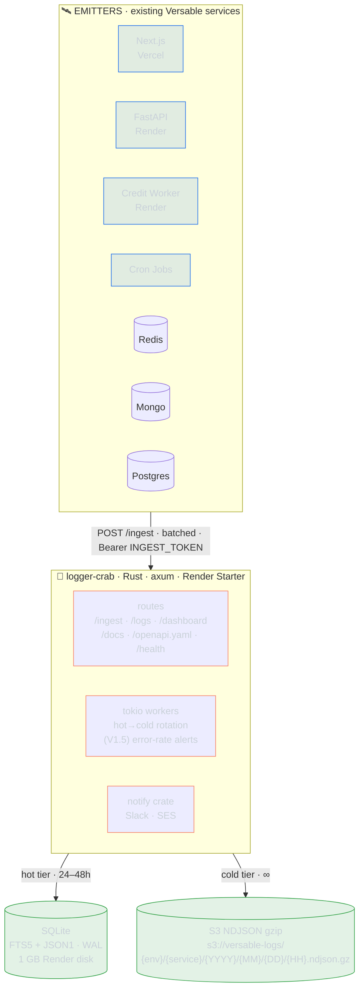
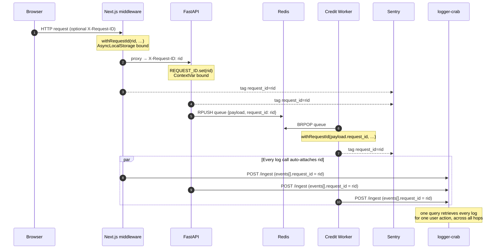
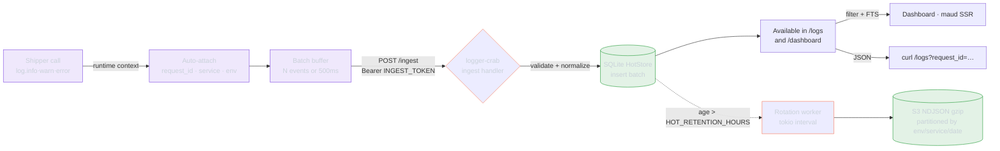
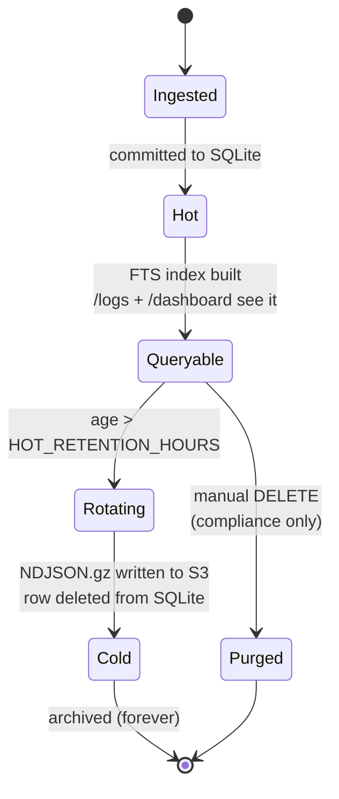

```
╔══════════════════════════════════════════════════════════════════════════════╗
║                                                                              ║
║      ██╗      ██████╗  ██████╗  ██████╗ ███████╗██████╗     ██████╗         ║
║      ██║     ██╔═══██╗██╔════╝ ██╔════╝ ██╔════╝██╔══██╗   ██╔════╝         ║
║      ██║     ██║   ██║██║  ███╗██║  ███╗█████╗  ██████╔╝   ██║              ║
║      ██║     ██║   ██║██║   ██║██║   ██║██╔══╝  ██╔══██╗   ██║              ║
║      ███████╗╚██████╔╝╚██████╔╝╚██████╔╝███████╗██║  ██║   ╚██████╗ rab     ║
║      ╚══════╝ ╚═════╝  ╚═════╝  ╚═════╝ ╚══════╝╚═╝  ╚═╝    ╚═════╝         ║
║                                                                              ║
║                Centralized logging for the Versable stack                    ║
║              rust · axum · sqlx · sqlite · s3 · maud · htmx                  ║
║                                                                              ║
╚══════════════════════════════════════════════════════════════════════════════╝
```

> One log service to bind them all. Crude V1, deliberately disposable.

`logger-crab` collects structured log events from every Versable runtime
(Next.js web/edge/serverless, FastAPI, credit worker, cron jobs) into a single
SQLite hot tier and rotates them to S3 NDJSON for cold storage. Every event
is auto-tagged with a `request_id` that threads through `X-Request-ID`
headers, Redis payloads, and Sentry scope — so you can pull every log line
for a single user action across every service it touched, in chronological
order, in one query.

It is designed to **stay out of the way at callsites** (one-line `log.info(...)`
with no request_id passing) and **out of the way of your wallet** (Render
Starter $7/mo, SQLite on disk, no managed DB).

---

## Architecture



<sub>Terminal-rendered version: [`docs/architecture-terminal.txt`](docs/architecture-terminal.txt)</sub>

### The correlation backbone — request_id threading

Set **once** at each runtime edge. Every `log.info(...)` call deeper in the
stack auto-grabs it. No threading by hand, no parameter drilling.



### Ingest → query lifecycle



### Hot/cold tier state machine



---

## Quickstart (local)

```bash
# one-time
cargo build -p log-server

# boot with SQLite hot store + pre-seeded dummy events for the dashboard
mkdir -p var
PORT=8099 \
HOT_STORE=sqlite \
DATABASE_URL="sqlite://./var/dev.db" \
INGEST_TOKEN=dev-ingest \
DASHBOARD_TOKEN=dev-dash \
SEED_ON_BOOT=1 \
RUST_LOG=info \
cargo run -p log-server
```

Then open:

- **http://localhost:8099/** — dashboard (maud, dark by default, `☾/☀` toggle top-right, 15s auto-refresh)
- **http://localhost:8099/health** — `{ok, hot_ok, cold_ok}`
- **http://localhost:8099/logs?event_prefix=pipeline.** — JSON query API (send `Authorization: Bearer $DASHBOARD_TOKEN`)

The dashboard filter bar supports `request_id`, `service`, `env`, `event prefix`, `level`, and full-text search; clicking a `request_id` pins the trace. Every seeded event carries `payload.dummy: true` so production filters can exclude them cleanly (see [`docs/schema-evolution.md`](docs/schema-evolution.md)).

Ingest a batch manually:

```bash
curl -X POST http://localhost:8099/ingest \
  -H "Authorization: Bearer dev-ingest" \
  -H "Content-Type: application/json" \
  -d '{
    "resource": {"service": "my-app", "env": "dev"},
    "events": [
      {"request_id": "req_abc", "event": "demo.hello",
       "severity_number": 9, "message": "hi",
       "payload": {"foo": "bar"}}
    ]
  }'
```

### Env vars

| var               | default           | purpose                                                                                     |
| ----------------- | ----------------- | ------------------------------------------------------------------------------------------- |
| `PORT`            | `8080`            | HTTP port                                                                                   |
| `HOT_STORE`       | `memory`          | `memory` \| `sqlite`                                                                        |
| `DATABASE_URL`    | `sqlite::memory:` | SQLite path (`sqlite://./var/dev.db`)                                                       |
| `COLD_STORE`      | `noop`            | `noop` \| `s3` (s3 currently degrades to noop, Phase 5)                                     |
| `INGEST_TOKEN`    | _unset_           | Bearer guarding `POST /ingest`. If unset, `/ingest` is open (dev only)                      |
| `DASHBOARD_TOKEN` | _unset_           | Bearer guarding `GET /logs`. Dashboard HTML is always unauth — front with a proxy if public |
| `S3_LOGS_BUCKET`  | _unset_           | Phase 5                                                                                     |
| `AWS_REGION`      | `us-east-1`       | Phase 5                                                                                     |
| `SEED_ON_BOOT`    | _unset_           | `1` → insert 16 demo events on startup (traces, slow query, rate-limit, panic)              |

---

## Repository layout

```
logger-crab/
├── crates/
│   ├── log-server/         # axum + sqlx service binary (Render-deployed)
│   └── notify/             # extractable Slack + SES helpers (workspace member)
├── shippers/
│   ├── typescript/         # @versable/logger-crab — Node + Browser
│   └── python/             # logger_crab — loguru sink + ContextVar helpers
├── docs/
│   ├── INTEGRATIONS.md     # per-emitter setup recipes
│   ├── DEPLOY.md           # Render walkthrough
│   ├── SCHEMA.md           # event schema reference
│   └── DASHBOARD.md        # query examples
├── render.yaml             # single source of deploy truth
├── .env.example            # all env vars documented
└── README.md
```

The Cargo workspace lets `log-server` depend on `notify` internally for
V1.5 Slack alerts. Other Versable services can pick up `notify` without
extracting it: `notify = { git = "https://github.com/versable/logger-crab" }`.

---

## Basic usage

The whole point: **callsites are one line.** No request_id passing.

### TypeScript / Next.js

```ts
// frontend/src/middleware.ts — set request_id once per request
import { withRequestId } from "@versable/logger-crab";
import crypto from "node:crypto";

export function middleware(req: Request) {
  const rid = req.headers.get("x-request-id") ?? crypto.randomUUID();
  return withRequestId(rid, () => {
    const res = NextResponse.next();
    res.headers.set("x-request-id", rid);
    return res;
  });
}
```

```ts
// Anywhere downstream — RSC, API route, server action, client component
import { log } from "@versable/logger-crab";

log.info("auth.login.attempt", { email });
log.warn("payment.retry", { user_id, attempt: 3 });
log.error("payment.charge.failed", { user_id, amount }, err);
```

### Python / FastAPI

```python
# backend/api/middleware/request_id.py — set request_id once per request
from logger_crab import REQUEST_ID
import uuid

async def request_id_middleware(request, call_next):
    rid = request.headers.get("x-request-id") or str(uuid.uuid4())
    token = REQUEST_ID.set(rid)
    try:
        response = await call_next(request)
        response.headers["x-request-id"] = rid
        return response
    finally:
        REQUEST_ID.reset(token)
```

```python
# Anywhere downstream
from logger_crab import log

log.info("pipeline.preview.requested", job_id=job_id, parts=len(parts))
try:
    do_work()
except Exception as e:
    log.error("pipeline.preview.failed", error=e, job_id=job_id)
    raise
```

### Worker (Node, BRPOP loop)

```ts
import { withRequestId, log } from "@versable/logger-crab";

while (true) {
  const popped = await redis.brpop(QUEUE, 5);
  if (!popped) continue;
  const payload = JSON.parse(popped[1]);

  await withRequestId(payload.request_id ?? crypto.randomUUID(), async () => {
    log.info("worker.event.received", { event_id: payload.id });
    await processEvent(payload);
    log.info("worker.event.completed", { event_id: payload.id });
  });
}
```

### Querying logs

```bash
# All events for one request_id, across every service it touched
curl -H "Authorization: Bearer $DASHBOARD_TOKEN" \
  "https://logger-crab.onrender.com/logs?request_id=abc-123"

# All errors in pipeline previews in the last hour
curl -H "Authorization: Bearer $DASHBOARD_TOKEN" \
  "https://logger-crab.onrender.com/logs?event_prefix=pipeline.preview.&level=error&since=1h"

# Full-text search in payloads
curl -H "Authorization: Bearer $DASHBOARD_TOKEN" \
  "https://logger-crab.onrender.com/logs?q=stripe+timeout&env=prod"
```

Or open `https://logger-crab.onrender.com/dashboard` for the live tail,
request inspector, and query builder UI.

---

## Event schema

```ts
type LogEvent = {
  request_id: string; // UUIDv4, auto-propagated across hops
  service: string; // "next-web" | "fastapi" | "credit-worker" | ...
  env: "dev" | "staging" | "prod";
  event: string; // dotted name, e.g. "pipeline.preview.submitted"
  level: "debug" | "info" | "warn" | "error" | "fatal";
  ts: string; // ISO8601 UTC, ms precision
  payload: Record<string, unknown>; // arbitrary JSON

  // Optional — auto-hoisted from payload by the shipper for indexed queries
  user_id?: string;
  team_id?: string;
  job_id?: string;
  run_id?: string;
  task_id?: string;

  trace?: string;
  sentry_event_id?: string;
};
```

**Discipline:** `event` is a dotted name, not free text — human messages go in
`payload.message`. Log liberally in V1; we'll prune what's useless after two
weeks of real queries.

---

## Deploy

```bash
# 1. Create the Render service from render.yaml (one-time)
#    Render auto-provisions the 1 GB persistent disk for SQLite.

# 2. Set env vars in Render dashboard:
#    INGEST_TOKEN          openssl rand -hex 32
#    DASHBOARD_TOKEN       openssl rand -hex 32
#    AWS_ACCESS_KEY_ID     IAM user with s3:PutObject on versable-logs/*
#    AWS_SECRET_ACCESS_KEY
#    S3_BUCKET             versable-logs
#    S3_REGION             us-east-1

# 3. Push to main → auto-deploy.

# 4. Smoke test
curl https://logger-crab.onrender.com/health
# → {"ok": true}
```

Full walkthrough: [`docs/DEPLOY.md`](docs/DEPLOY.md).

---

## Improvements / roadmap

V1 is **deliberately crude**. Build it, use it for two weeks, then decide what
matters. Items below are tracked but not committed to.

### V1.5 — when V1 has shipped and we know what hurts

- **Slack alerting** via `notify::slack`. Error-rate spike detection on ingest
  with a 5-min dedup window and configurable thresholds per service+env.
- **PII / secrets redaction** on ingest. Regex pass over the payload for AWS
  keys, JWTs, Stripe keys, email addresses. V1 relies on caller discipline.
- **Buffered-to-disk shipper retries.** V1 drops events on POST failure;
  V1.5 should retry from a small on-disk queue.
- **Shipper distribution.** V1 ships via git-dep. V1.5 picks npm + PyPI if the
  iteration loop becomes painful.
- **Dashboard niceties.** Saved queries, link-shareable filters, NDJSON
  download already in V1 — extend with CSV export and per-request flame view.

### V2 — if logger-crab is still the right answer in 6 months

- **OpenTelemetry compatibility.** Map our schema to OTel log records so we
  can swap the backend (Loki, ClickHouse, Honeycomb) without rewriting
  emitters.
- **Real auth.** Google OAuth (Workspace-domain restricted) for the
  dashboard. Bearer tokens stay for ingest.
- **SES email service** as the second extractable in `notify`. Used by the
  main app for transactional email, lifted out when a third project needs it.
- **Indexing arbitrary payload fields.** V1 only indexes the hoisted tags
  (`user_id`, `team_id`, etc) — V2 lets you declare extra indexed fields per
  service.
- **Replay / reprocess from S3.** V1 treats cold storage as archival;
  V2 lets you pump a date range back into hot for re-querying.

### Out of scope, on purpose

- Metrics, counters, gauges → that's Sentry's job
- Multi-tenancy (one Versable, one log service)
- High-throughput ingest (we're at ~10k events/day, not millions)
- Replacing Sentry (it handles errors + alerting; this handles narrative
  log streams)

---

## Why "logger-crab"

Crabs scuttle sideways through cracks, pick up whatever they find, and store
it in a shell. This service does the same with log events from every corner
of the stack. Also: Rust's mascot is a crab. The name was non-negotiable.
